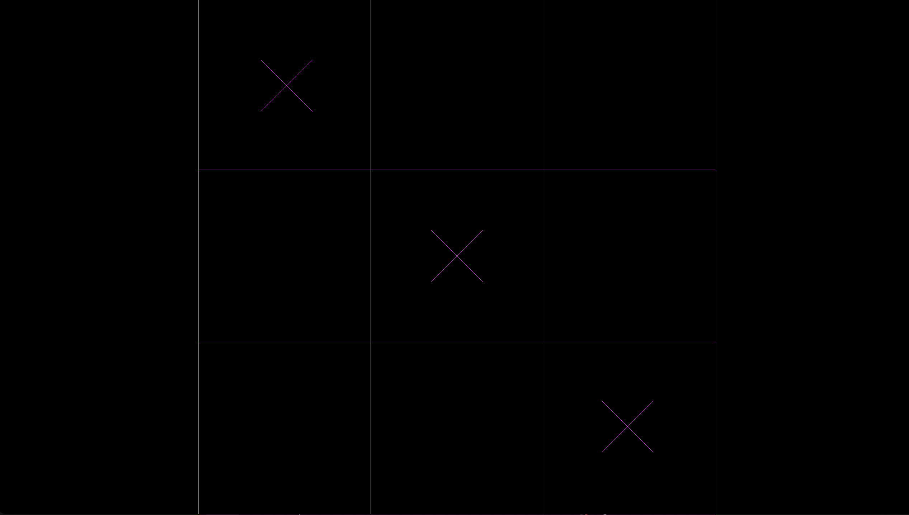

# Tic Tac Toe Extreme

Author: Ari Liloia

Design: My goal was to create a version of tic tac toe with multiple players and multiple new possible actions like blocking. I started out by trying to make the existing code for sending player positions send new values, but I was not able to send correct values - I either sent zeros or values that quickly increased from 0 to 255. I implemented part of the game logic - right now players can play by themselves and win, and while messages about the grid square clicked are sent to the server, I'm not sure why they are not what I expect them to be when received at the server, or why they are not being sent back to the client. 

Networking: (TODO: How does your game implement client/server multiplayer? What messages are transmitted? Where in the code?)
My game implements (would have implemented) client/server multiplayer by assigning each new player an ID at the start of the game, keeping track of a game state board on the server while making sure that game rules are being followed on the client side. Messages that would have been transmitted consist of the player's ID and the spot on the grid at which they wish to place an X or O. 

Screen Shot:

How To Play:

Click on the grid squares to drop either an X or an O.

Sources: (TODO: list a source URL for any assets you did not create yourself. Make sure you have a license for the asset.)

This game was built with [NEST](NEST.md).

